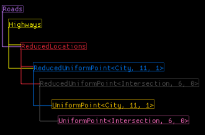
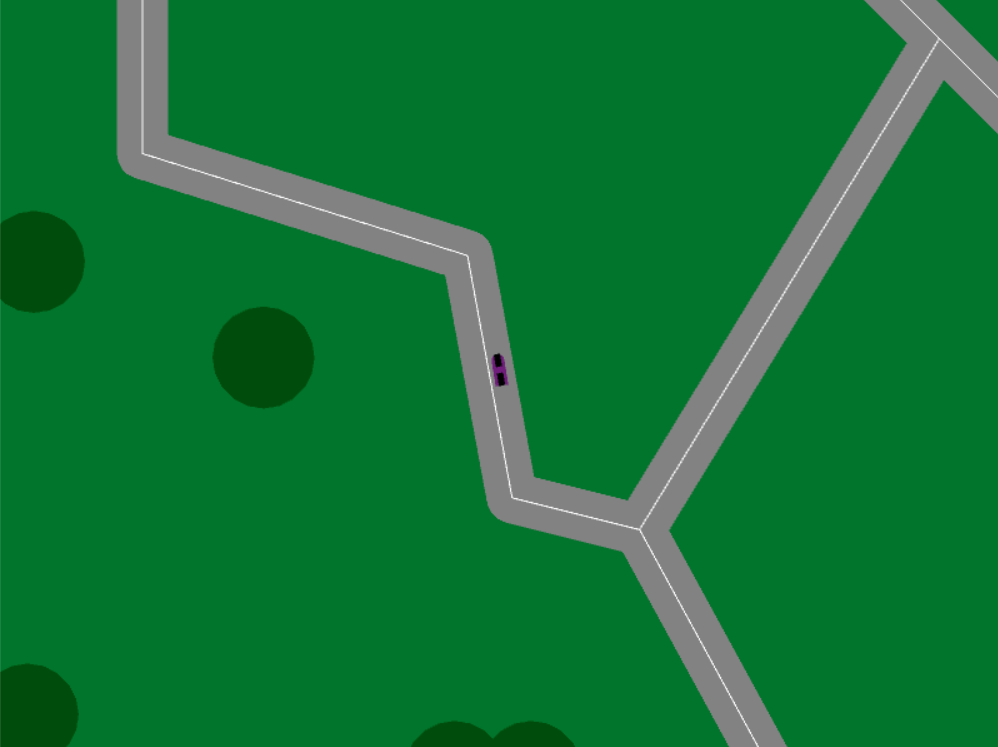
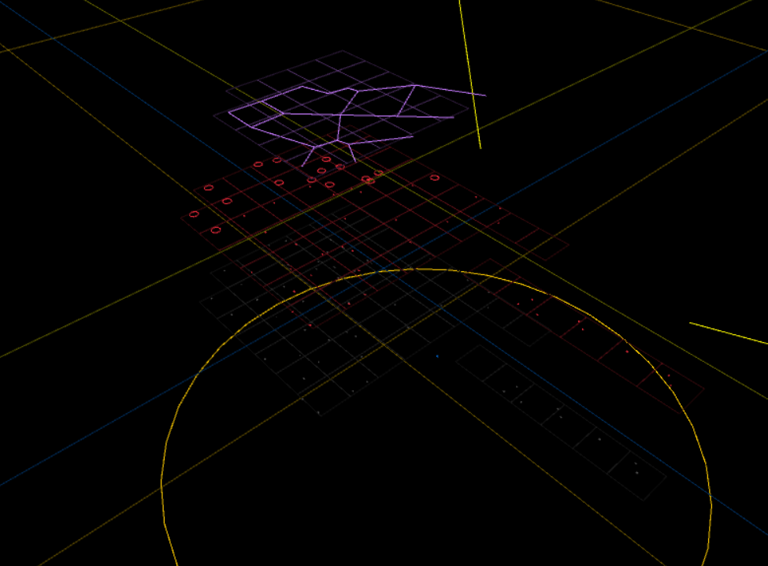

# Top down procedural generation framework

A Rust implementation of <https://github.com/runevision/LayerProcGen>

Each layer can use information from its dependency layers, including an arbitrarily
larger region of information from its dependency layers. This allows you to write chunk-based logic, without caring about boundary conditions, as there are none.

If you are tempted to use boundary conditions out of any reason, add another layer.

Chunks are cached once computed, so accessing them repeatedly is cheap. Once too many chunks are loaded, those that have been accessed the longest time in the past will
get freed automatically. By default reasonable limits for the number of loaded chunks are chosen, but you can increase or decrease them if the layers have specific other requirements.

An example game is included in the `examples` section of this crate. It is an infinite
world of small towns and medium sized cities, connected by inter-city roads.

The game supports various debug views to experience the layer algorithms visually via the
`F` keys:

1. Show vehicle movement debug information and the visible screen space. Use `Up` and `Down` keys for zooming in and out. If you zoom out far enough, you see the roads loading in the distance.
2. Debug render all chunks that are loaded, not just the ones within the visible area. Again, `Up` and `Down` make this actually interesting, as you can see when chunks start unloading in the distance.
3. Show the dependency graph of layers. Press `ESC` to leave.
4. Show a 3d representation of all layers' debug render stacked on top of each other

## Notable differences to Rune's original C# version

* You only need to implement `Chunk`s, not `Layer`s, as the latter are a provided struct exposing everything you need from a layer for a specific `Chunk` type.
* More compile-time shenanigans
    * Chunk positions are typed to the `Chunk` so you don't accidentally mix them with others
    * Chunk sizes are constants, not runtime values
* Chunks are generated as needed, you do not need to load a region.
    * you can still load a region if you know you're going to need it soon, but it's not very useful due to the missing multithreading support
* Missing multithreading support, the demo is fast enough so far to compute all necessary chunks in sub-millisecond time.
* No internal layer levels. Instead you can make the layer type not use a heap relocation but contain the data directly, to avoid adding another indirection if you are never going to use a dependency layer twice. This simplifies the interface and makes it a bit more robust against accidentally depending on information from chunks of the current layer.
